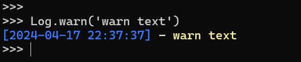
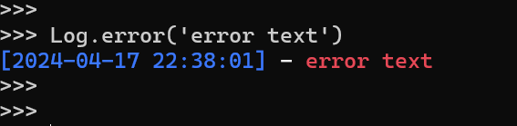

# Onlylog

Just simple log for python 3

# Installation

```
pip install onlylog
```

# How to Use

Just 1 line require, simple :v 

```
from onlylog import Log
```

## Success

with gree color text

```
Log.success('success text')
```


## Warning

with yellow color text

```
Log.warn('warn text')
```



## Error

with red color text



## Save to file

Save log to file

```
Log.write(file="app.log",text="log to save")
```

## Countdown

Like method name this is for countdown

```
# parameter with second 100 is 100 second !

Log.countdown(100)
```

# Donation

If you want to donate your money to me you can follow link in below xD

Trakteer [https://trakteer.id/fawwazthoerif/tip](https://trakteer.id/fawwazthoerif/tip)

Socialbuzz [https://sociabuzz.com/fawwazthoerif/tribe](https://sociabuzz.com/fawwazthoerif/tribe)

# Thank you < 3